# STA321—Project Report

**Member:** 张弛（12110821），胡嘉维（12110820）

---

## Problem Description

Given the *Order* data and *Trade* data, compute the lowest transaction price level `K` of each recorded market order using HDFS and MapReduce. 

## Task Comprehension

-	All the market orders are stored in *Order* data, while all the transactions are recorded in the *Trade* data. Therefore, the core of the task is to use the primary key `ApplSeqNum` to link the two part of data.
-	Difficulties Analysis: There are some difficulties or crucial details in this task.
    1. In the reduce phase, how to select the records from *Traded* for counting and ignore others?
    2. There may be a case where an order is released before 09:30 but traded in the continuous auction period. How to ignore these orders?
    3. After counting for the answer, how to sort the records in the order of time, and how to sort the transaction data by `ApplSeqNum` if they are at the same time?

## Code Design

Now we introduce the code design:

+ We design two mapper classes `OrderInputMapper` and `TradeInputMapper` for `MAP1`, responsible for reading and processing the data from *Order* and *Trade* data respectively;
+ We implement the counting program as the reducer class `FindKReducer` for `REDUCE1`;
+ The mapper class `MapJoinMapper` undertakes the task of `MAP2`, while the reducer class `OutputReducer` is written for the final output;
+ The `Driver` class integrates the two MapReduce jobs, with the `runJob1()` function instructs the first job and `join_sort()` instructs the second.

## Concrete workflow

The concrete workflow of our work is shown below. 

Our work is assigned to two MapReduce jobs. 

- The map phase of the first job (`MAP1` in short) first separates *MarketOrder*, *LimitOrder* and *SpecOrder* from the *Order* data, and *Cancel* and *Traded* from the *Trade* data. Then `MAP1` emits all the data with `ApplSeqNum` as the key (for *Traded*, outputs two `<k,v>` pairs for each traded record with `BidApplSeqNum` and `OfferApplSeqNum` as the key respectively). 

	>  **Solution for difficulty 1:**
	>
	>  While emits the data in the `MAP1`, arrange each record here in the final output form (which is of 8 fields) except for the data from *MarketOrder* (7 fields ), *Traded* (7 fields) and *Cancel* (9 fields), so that the data to be submitted into the reducers can be distinguished.
	>
	>  In `REDUCE1`, for each key (`ApplSeqNum` for *Order* data and `BidApplSeqNum`, `OfferApplSeqNum` for *Trade* data), we have the value with different lengths:
	>
	>  - If length = 7 (`TIMESTAMP`, `PRICE`, `SIZE`, `BUY_SELL_FLAG`, `ORDER_TYPE`, `CANCEL_TYPE`, `AUX`), then it is used to find `K`. In details, `AUX` marks where the record is from --- `AUX = 1` for *MarketOrder* and `AUX = 2` for *Traded*.
	>
	>  - If length = 8 (`TIMESTAMP`, `PRICE`, `SIZE`, `BUY_SELL_FLAG`, `ORDER_TYPE`, `ORDED_ID`, `MARKET_ORDER_TYPE`, `CANCEL_TYPE`), just output.
	>  - If length = 9 (`TIMESTAMP`, `PRICE`, `SIZE`, `BUY_SELL_FLAG`, `ORDER_TYPE`, `ORDED_ID`, `MARKET_ORDER_TYPE`, `CANCEL_TYPE`, `ApplSeqNum`), just output.

- Afterward `<k,v>` pairs from the *Traded* with the same `ORDER_ID` are submitted to `REDUCE1` for counting (which just yields the number `K` of transaction price levels of the market order). 

  >  **Solution for difficulty 2:**
  >
  >  In our program each market order will yield two part of records at the end of `MAP1` (with the first part from *Order* and the second from *Traded*), which is marked by the auxiliary field `AUX` described in **Solution for difficulty 1**. For an order posted beyond the continuous auction period, the part from *Order* is missing, this way we can detect and drop this type of order.

- In the job 2, `MAP2` takes in the output of job1 and emits them with the `TIMESTAMP` as the key, so that all the records are automatically sorted in the order of time in the shuffle phase before committed to the `REDUCE2` for a final adjustment for the required format.

- Finally, in `OutputReducer` of `REDUCE2` the records with the same `TIMESTAMP` are sorted in the order of `ApplSeqNum` before output as a file. 

	>  **Solution for difficulty 3:**
	>
	>  1. To sort the final output in time order, we take the `TIMESTAMP` as the key to submit the records to `OutputReducer`, taking advantage of the shuffle phase.
	>  2. If the transaction data are at the same time, we sort the records by `ApplSeqNum` using `TreeMap`. If additionally the cancel data is required to be placed after the order data, we can build two trees for order and cancel data respectively, and let the cancel-tree follow the order-tree. Furthermore, there is an additional field in cancel data (see **Solution for difficulty 1**), the programme can easily detect the cancel data.

