# 

## Problem Description

Given the *Order* data and *Trade* data, compute the lowest transaction price level of each recorded market order using HDFS and MapReduce. 

## Task Comprehension
All the market orders are stored in *Order* data, while all the transactions are recorded in the *Trade* data.
Therefore, the core of the task is to use the primary key `ApplSeqNum` to link the two part of data.

## Difficulties Analysis

There are some difficulties or crucial details in this task:
1. In the reduce phase, how to select the records from *Traded* for counting and ignore others?
2. After counting for the answer, how to sort the records in the order of time?
3. There may be a case where an order is released before 09:30 but traded in the continuous auction period. How to ignore these orders?

## Concrete workflow
The concrete workflow of our work is shown below. 

Our work is assigned to two MapReduce jobs. The map phase of the first job (`MAP1` in short) first separates *MarketOrder*, *LimitOrder* and *SpecOrder* from the *Order* data, and *Cancel* and *Traded* from the *Trade* data. Then `MAP1` emits all the data with `ApplSeqNum` as the key (for *Traded*, outputs two `<k,v>` pairs for each traded record with `BidApplSeqNum` and `OfferApplSeqNum` as the key respectively). Afterward the `<k,v>` pairs from the *Traded* with the same `ApplSeqNum` are submitted to `REDUCE1` for counting (which just yields the number `K` of transaction price levels of the market order). In the job 2, `MAP2` takes in the output of `MAP1` and emits them with the `TIMESTAMP` as the key, so that all the records are automatically sorted in the order of time in the shuffle phase before committed to the `REDUCE2` for a final adjustment for the required format.

## Code Design
Now we introduce the code design:
+ We design two mapper classes `OrderInputMapper` and `TradeInputMapper` for `MAP1`, responsible for reading and processing the data from *Order* and *Trade* data respectively;
+ We implement the counting program as the reducer class `FindKReducer` for `REDUCE1`;
+ The mapper class `MapJoinMapper` undertakes the task of `MAP2`, while the reducer class `OutputReducer` is written for the final output;
+ The `Driver` class integrates the two MapReduce jobs, with the `runJob1()` function instructs the first job and `join_sort()` instructs the second.

## Difficulty Solution
For the difficulties or vital details listed previously, we solve them as follows:
1. While emits the data in the `MAP1`, arrange each record here in the final output form (which is of 8 fields) except for the data from *MarketOrder* and *Traded* (which is designed to be of 7 fields), so that the data to be submitted into the reducers can be distinguished.
2. To sort the final output in time order, we take the `TIMESTAMP` as the key to submit the records to `OutputReducer`, taking advantage of the shuffle phase.
3. In our program each market order will yield two part of records at the end of `MAP1` (with the first part from *Order* and the second from *Traded*), which is marked by an auxiliary fields. For an order posted beyond the continuous auction period, the part from *Order* is missing, this way we can detect and drop this type of order.